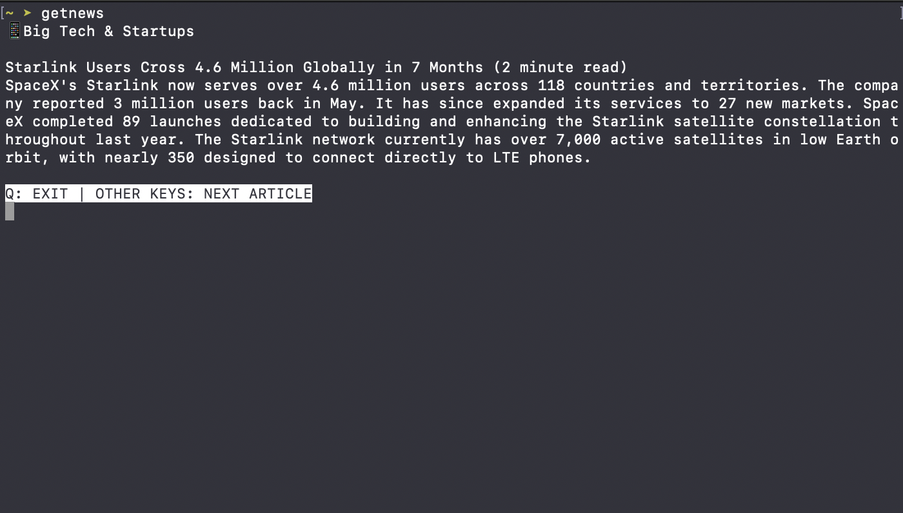
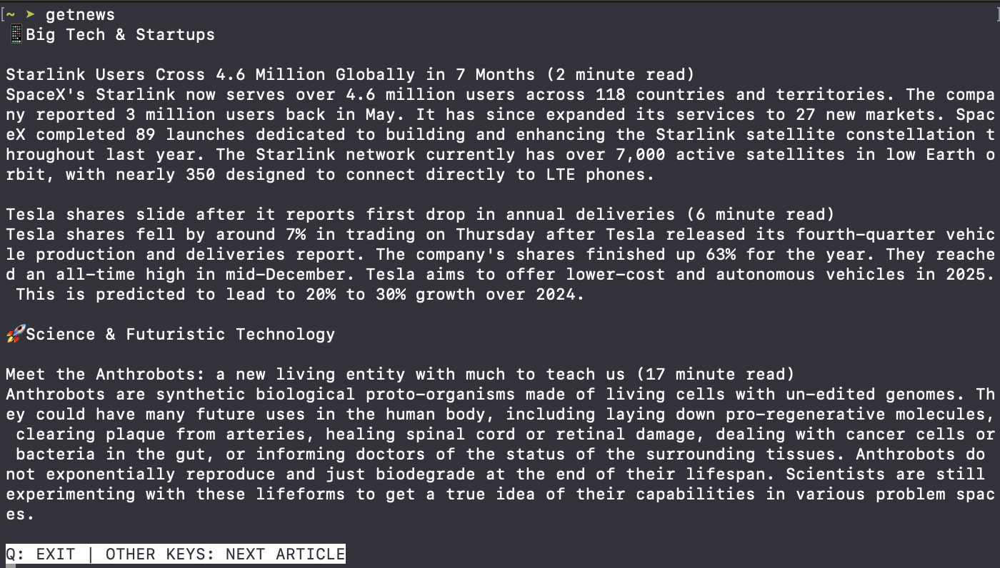

# Read The News on Terminal
## Introduction

The world of tech is evolving faster and faster and it has become time consuming and inefficient to follow different sources of news in order to keep up with everything. Thanks to [TLDR Newsletter](https://tldr.tech/), You can get a quick update of the tech world every day and keep up with the rapid rate of 

## Requirements

TODO: Add the requirements

## Installation

Add the following line in `~/.zshrc` or `~/.bashrc` depending on which one you are using.

```bash
alias getnews='python path/to/main.py'
```

Then re-start the terminal (quit and re-open; it doesn't mean using `reset`), or alternatively use the following command if you are using bash terminal:
```bash
exec bash
```
or if you are using zsh terminal then use the following:
```bash
exec zsh
```

Now use the applicaiton with the `getnews` command in your terminal with ease.




## Contribution
TODO: write contribution guide
